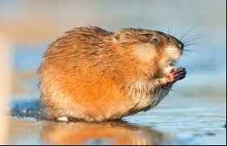
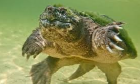

# Wildlife-of-Flag-Pond 
 
 ##  Animals: 

 ###  **1. Mammals** 

 
 
 * Muskrat (*Ondatra zibethicus*)

 

  **2. Reptiles**

 

* Snapping Turtle *Chelydra serpentina*

* Painted Turtle 

### **3. Fish**

* Chain Pickerel (*Esox niger*)

  

> To improve this report, more survey data could be added

> another good soure for information on the wildlife of MA is [Masswildlife](https://www.mass.gov/service-details/mammals-in-massachusetts)
 

 

